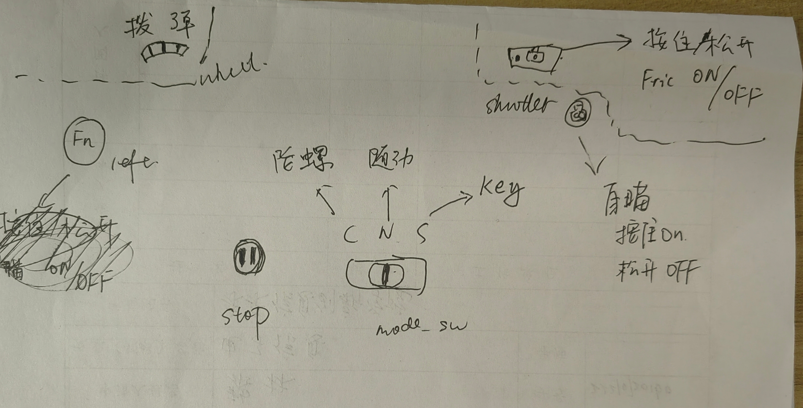

# 新图传协议移植

## 1.主要改动
### 接口
- 由串口3改为串口6
- 串口6波特率 921600，配置rx的dma，优先级为`very high`
### 数据包
- 数据格式 ：见`remotec.cpp`，`void remotec::vt13_to_rc( const uint8_t* VT13_buf)`函数
- crc校验： 与视觉crc校验格式相同，具体见`User/Framework/VISION/crc.cpp`

2. 接口
- 3pin串口：改到串口6，即UART1；
- 波特率： 921600
---
## 2. 移植
### step1：修改MX中串口6配置
### step2：移植 `User/MCUDriver/REMOTEC`与`User/Framework/REMOTEC`文件夹下的文件：

这两组文件中，`User/MCUDriver/REMOTEC`中主要涉及`huart6`的初始化与DMA相关配置。

`User/Framework/REMOTEC`中主要是数据包解包与crc校验相关，同时涉及一些云台的配置

### step3：修改拨弹相关：
`User/Framework/SHOOTC/shootc.cpp`中涉及拨弹判断的部分从`MyRemote.rc_ctrl.rc.ch[4]`修改为`MyRemote.rc_ctrl.rc.wheel`

---
## 3.键位对应
